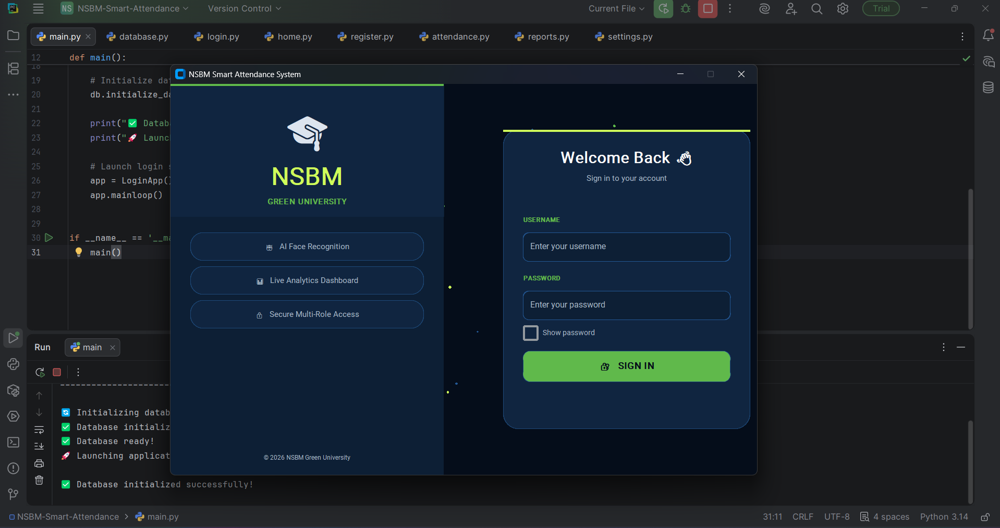
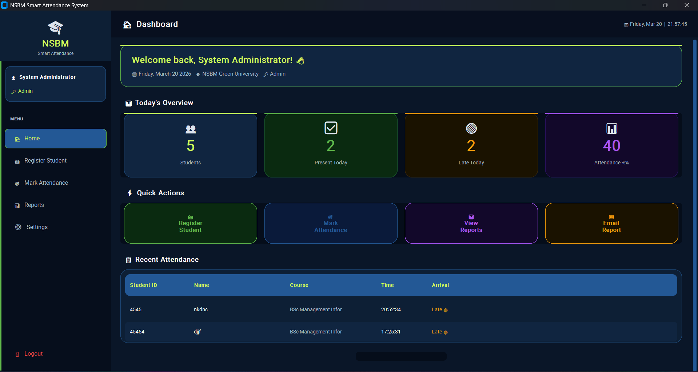
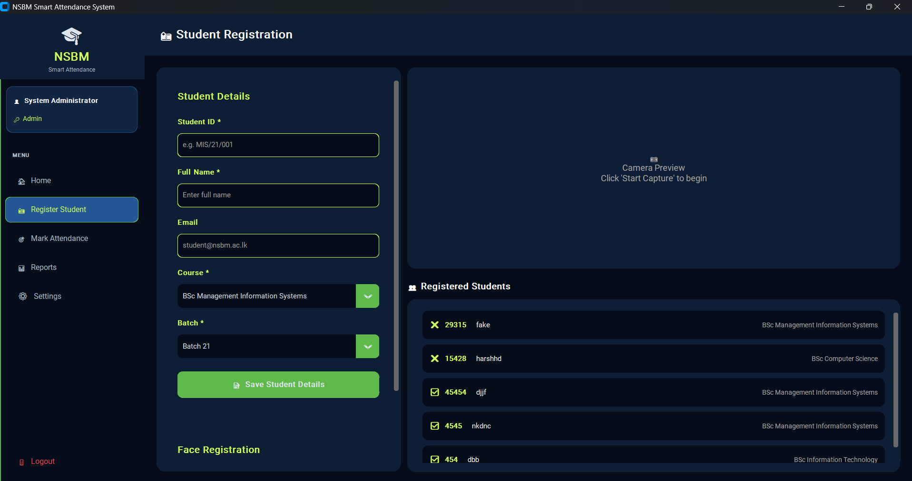
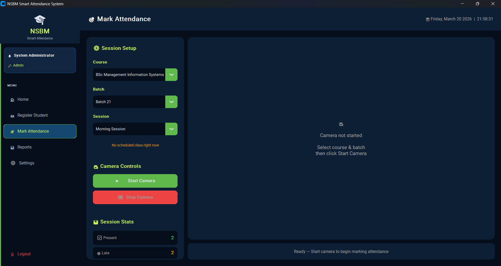
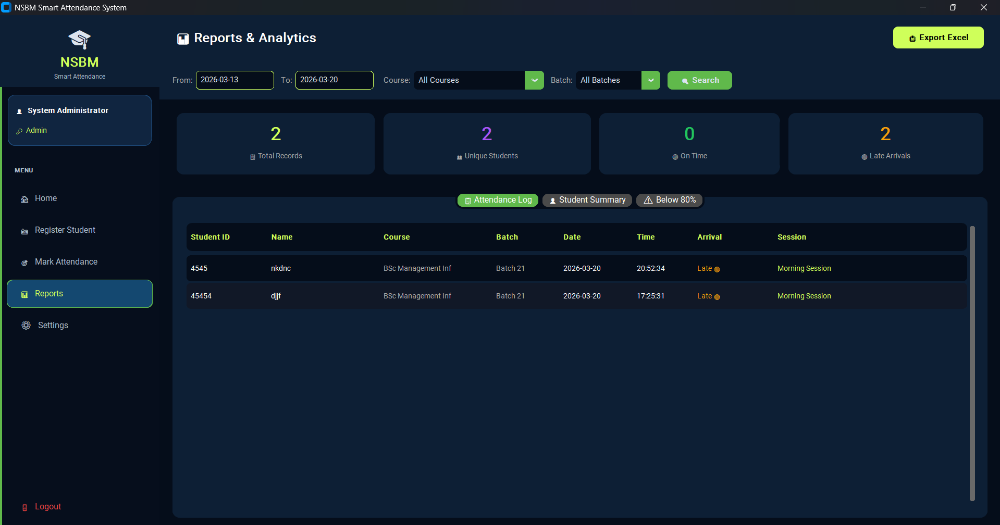
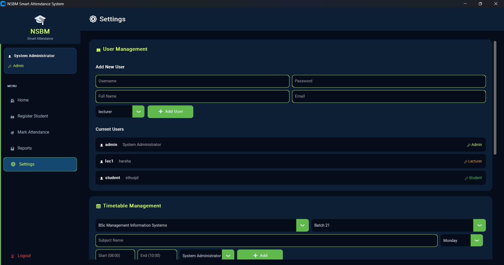

<div align="center">


---

[](https://git.io/typing-svg)

<br/>


<br/><br/>


</div>

---


---

## 🎯 What is This?

<table>
<tr>
<td width="60%" valign="top">

A **fully functional AI-powered Desktop Application** built exclusively for **NSBM Green University**. The system uses **OpenCV LBPH Face Recognition** to automatically detect, identify and mark student attendance in real-time through a webcam — eliminating manual roll calls and proxy attendance forever.

The application is packaged as a **Windows .exe** file — no Python installation required on target machines!

> 🎓 *"From registration to report generation — fully automated with AI!"*

</td>
<td width="40%" align="center" valign="top">


</td>
</tr>
</table>

---


---

## 🏗️ System Architecture

```
┌─────────────────────────────────────────────────────────────┐
│                   NSBM Smart Attendance                     │
│                      main.py (Launcher)                     │
└──────────────────────────┬──────────────────────────────────┘
                           │
            ┌──────────────▼──────────────┐
            │        login.py             │
            │   🔒 Authentication Layer   │
            │   Admin | Lecturer | Student│
            └──────────────┬──────────────┘
                           │
            ┌──────────────▼──────────────┐
            │         home.py             │
            │    🏠 Dashboard & Router    │
            └──┬────────┬────────┬────────┘
               │        │        │
    ┌──────────▼──┐  ┌──▼─────┐  ┌▼──────────┐
    │register.py  │  │attend. │  │reports.py │
    │📸 Face Reg  │  │🎯 Mark │  │📊 Reports │
    └──────┬──────┘  └──┬─────┘  └───────────┘
           │            │
    ┌──────▼─────────────▼──────┐
    │        database.py        │
    │   🗄️ SQLite Data Layer    │
    │  Users|Students|Attend.   │
    └───────────────────────────┘
```

---


---

## ✨ Features

<table>
<tr>
<td width="50%">

### 🔐 Security & Access
- 🔒 **Secure Login** — Multi-role authentication
- 👨‍💼 **Admin Panel** — Full system control
- 👨‍🏫 **Lecturer Access** — Mark & view class attendance
- 👨‍🎓 **Student Portal** — View own records
- 🔑 **Password Protection** — Encrypted credentials

### 🤖 AI & Recognition
- 📸 **Face Registration** — Capture 50 face samples
- 🧠 **LBPH Algorithm** — Accurate face recognition
- ⚡ **Real-time Detection** — Live webcam processing
- 🔍 **Confidence Score** — Recognition accuracy display
- ⚠️ **Unknown Detection** — Flag unregistered faces

### 📅 Attendance Management
- ✅ **Auto Marking** — Instant attendance on recognition
- 🔴 **Late Detection** — Configurable late arrival time
- 🔁 **Duplicate Check** — Prevent double marking
- 📚 **Session Tracking** — Morning/Afternoon/Lab sessions
- 🕒 **Timetable Integration** — Auto-detect current class

</td>
<td width="50%">

### 📊 Reports & Analytics
- 📋 **Attendance Log** — Full detailed records
- 👤 **Student Summary** — Individual attendance stats
- ⚠️ **Below 80% Alert** — Automatic warning list
- 📆 **Date Range Filter** — Custom period reports
- 🎓 **Course/Batch Filter** — Targeted reports
- 📥 **Excel Export** — Professional formatted reports

### 🎨 UI & Experience
- 🌙 **Glassmorphism Design** — Modern dark theme
- 🎨 **NSBM Color Scheme** — Official university colors
- 💫 **Smooth Animations** — Professional transitions
- 🔢 **Animated Counters** — Live stat updates
- 💡 **Glow Effects** — Interactive hover animations
- 📱 **Responsive Layout** — Adapts to window size

### 📧 Communication
- 📧 **Email Reports** — Auto daily summary
- 📊 **Excel Attachment** — Report in email
- 🎨 **HTML Email** — Beautiful formatted email

</td>
</tr>
</table>

---


---

## 📊 System Stats at a Glance

```
╔══════════════════════════════════════════════════════════════╗
║              📊 NSBM Smart Attendance — Stats                ║
╠══════════════╦═══════════════╦══════════════╦════════════════╣
║  👥 Students ║ 📋 Attendance ║  🎓 Courses  ║  👤 User Roles ║
║   Unlimited  ║   Auto-saved  ║      5+      ║      3         ║
╠══════════════╬═══════════════╬══════════════╬════════════════╣
║  📸 Samples  ║  🎯 Accuracy  ║  📦 App Size ║  🖥️ Platform  ║
║  50 per face ║    90 pct+    ║   ~250 MB    ║  Windows 10/11 ║
╚══════════════╩═══════════════╩══════════════╩════════════════╝
```

---

## 🗄️ Database Schema

```
📦 attendance.db (SQLite)
│
├── 👥 users
│   ├── id, username, password
│   ├── role (admin/lecturer/student)
│   └── full_name, email
│
├── 🎓 students
│   ├── student_id, full_name, email
│   ├── course_id  courses.id
│   ├── batch_id   batches.id
│   └── face_registered (0/1)
│
├── 📚 courses
│   ├── id, name, code
│   └── department_id  departments.id
│
├── 📅 timetable
│   ├── course_id, batch_id
│   ├── subject, day_of_week
│   ├── start_time, end_time
│   └── lecturer_id  users.id
│
└── ✅ attendance
    ├── student_id, student_name
    ├── course_id, batch_id
    ├── date, time, status
    ├── arrival (On Time / Late)
    ├── session, marked_by
    └── created_at
```

---


---

## 🖥️ App Screenshots

### 🔒 Login Screen
> Glassmorphism design with particle animation



---

### 🏠 Home Dashboard
> Animated stat counters and quick actions



---

### 📸 Student Registration
> Face capture with live camera preview



---

### 🎯 Mark Attendance
> Real-time face recognition with confidence display



---

### 📊 Reports & Analytics
> Tabbed reports with filters and Excel export



---

### ⚙️ Settings Panel
> User management and timetable setup


```

---

## STEP 4 — Commit Changes

Commit message:
```
📸 Add app screenshots to README

---

## 🎓 NSBM Departments & Courses

```
🏛️ Faculty of Computing (FOC)
    ├── BSc Management Information Systems (MIS)
    ├── BSc Computer Science (CS)
    ├── BSc Information Technology (IT)
    └── BSc Software Engineering (SE)

🏛️ Faculty of Business (FOB)
    └── BSc Business Management (BM)

🏛️ Faculty of Engineering (FOE)
🏛️ Faculty of Science (FOS)
```

---


---

## 🚀 Quick Start

### Prerequisites
```bash
pip install customtkinter opencv-python pillow pandas openpyxl
```

### Run the App
```bash
python main.py
```

### OR — Run the .exe
```
1. Download NSBM_SmartAttendance.zip from Releases
2. Extract the zip file
3. Double click NSBM_SmartAttendance.exe
4. No Python installation needed!
```

### Default Admin Login
```
Username : admin
Password : admin123
```

---

## 📁 Project Structure

```
NSBM-Smart-Attendance/
│
├── main.py           ← App entry point
├── database.py       ← SQLite models & queries
├── login.py          ← Authentication screen
├── home.py           ← Dashboard & navigation
├── register.py       ← Student & face registration
├── attendance.py     ← Real-time attendance marking
├── reports.py        ← Analytics & reports
├── settings.py       ← Admin settings panel
├── icon.png          ← Application icon
│
├── database/         ← SQLite database files
├── dataset/          ← Registered face images
├── snapshots/        ← Attendance snapshots
├── reports/          ← Generated Excel reports
└── dist/             ← Packaged .exe output
```

---


---

## 🛠️ Tech Stack

<div align="center">

| Category | Technology | Purpose |
|---|---|---|
| **Language** | Python 3.14 | Core development |
| **GUI Framework** | CustomTkinter | Modern desktop UI |
| **Face Recognition** | OpenCV LBPH | AI detection engine |
| **Computer Vision** | OpenCV | Camera & image processing |
| **Database** | SQLite | Local data storage |
| **Data Processing** | Pandas | Report analytics |
| **Excel Export** | OpenPyXL | Report generation |
| **Email** | SMTP + MIMEText | Auto email reports |
| **Packaging** | PyInstaller | Windows .exe creation |
| **Image Processing** | Pillow | UI image handling |

</div>

---

## 🗺️ Development Roadmap

```
Phase 1 — Core System
   SQLite database design
   Multi-role authentication
   Student registration

Phase 2 — AI Engine
   Face capture & training
   Real-time recognition
   Late arrival detection

Phase 3 — Analytics
   Reports & filters
   Excel export
   Email automation

Phase 4 — Polish
   Glassmorphism UI redesign
   NSBM color scheme
   Animations & effects
   Packaged as .exe

Phase 5 — Future (Coming Soon)
   QR Code scanning
   Mobile companion app
   Cloud sync
   SMS notifications
```

---


---

## 👨‍💻 Author

<div align="center">

### Harsha Dulshan Kaldera
**MIS Undergraduate | AI Researcher | Entrepreneur**
*NSBM Green University — Expected 2026*

[](https://github.com/harshadulshan)
[](mailto:hphdkaldera@gmail.com)

</div>

---

## 🤝 Contributing

Contributions are welcome! Feel free to:
- 🐛 Report bugs via Issues
- 💡 Suggest new features
- 🔧 Submit pull requests
- ⭐ Star the repository

---

## 📄 License

This project is licensed under the **MIT License** — see the [LICENSE](LICENSE) file for details.

---


<div align="center">

**⭐ If this project helped you, please give it a star! ⭐**

[](https://github.com/harshadulshan/NSBM-Smart-Attendance)
[](https://github.com/harshadulshan/NSBM-Smart-Attendance)

*Built with love for NSBM Green University*

</div>
